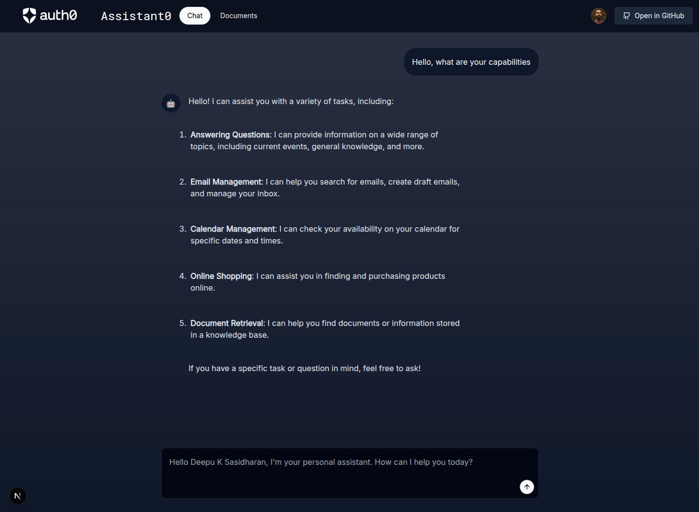

## Assistant0: An AI Personal Assistant Secured with Auth0

Assistant0 an AI personal assistant that consolidates your digital life by dynamically accessing multiple tools to help you stay organized and efficient. Here’s some of the features that can be implemented:

1. **Gmail Integration:** The assistant can scan your inbox to generate concise summaries. It can highlight urgent emails, categorizes conversations by importance, and even suggests drafts for quick replies.
2. **Calendar Management:** By interfacing with your calendar, it can remind you of upcoming meetings, check for scheduling conflicts, and even propose the best time slots for new appointments based on your availability.
3. **User Information Retrieval:** The assistant can retrieve information about the user from their authentication profile, including their name, email, and other relevant details.
4. **Online Shopping with Human-in-the-Loop Authorizations:** The assistant can make purchases on your behalf (using a fake API for demo purposes), with the ability to ask for human confirmation before finalizing transactions.
5. **Document Upload and Retrieval:** The assistant can upload PDF and text documents to the database and retrieve them for context during chat. The docs can be shared with other users.

With tool-calling capabilities, the possibilities are endless. In this conceptual scenario, the AI agent embodies a digital personal secretary—one that not only processes information but also proactively collates data from connected services to provide comprehensive task management. This level of integration not only enhances efficiency but also ushers in a new era of intelligent automation, where digital assistants serve as reliable, all-in-one solutions that tailor themselves to your personal and professional needs.

## 🚀 Getting Started

First, clone this repo and download it locally.

```bash
git clone https://github.com/auth0-samples/auth0-ai-samples.git
cd auth0-ai-samples/authenticate-users/next-js-starter
```

Next, you'll need to set up environment variables in your repo's `.env.local` file. Copy the `.env.example` file to `.env.local`.

You can setup a new Auth0 tenant with Token Vault enabled following the instructions [here](https://auth0.com/ai/docs/call-others-apis-on-users-behalf).

To start with the basic examples, you'll just need to add your OpenAI API key and Auth0 credentials.

Next, install the required packages using your preferred package manager (e.g. `bun install` or `npm install`).

Now you're ready to run the development server:

```bash
bun dev # or npm run dev
```

Open [http://localhost:3000](http://localhost:3000) with your browser to see the result! Ask the bot something and you'll see a streamed response:



You can start editing the page by modifying `app/page.tsx`. The page auto-updates as you edit the file.

Backend logic lives in `app/api/chat/route.ts`. From here, you can change the prompt and model, or add other modules and logic.

### Security Challenges with Tool Calling AI Agents

Building such an assistant is not too difficult. Thanks to frameworks like [LangChain](https://www.langchain.com/), [LlamaIndex](https://www.llamaindex.ai/), and [Vercel AI](https://vercel.com/ai), you can get started quickly. The difficult part is doing it securely so that you can protect the user's data and credentials.

Many current solutions involve storing credentials and secrets in the AI agent application’s environment or letting the agent impersonate the user. This is not a good idea, as it can lead to security vulnerabilities and excessive scope and access for the AI agent.

### Tool Calling with the Help of Auth0

This is where Auth0 comes to the rescue. As the leading identity provider (IdP) for modern applications, our upcoming product, [Auth for GenAI](https://a0.to/ai-content), provides standardized ways built on top of OAuth and OpenID Connect to call APIs of tools on behalf of the end user from your AI agent.

Auth0's [Token Vault](https://auth0.com/docs/secure/tokens/token-vault) feature helps broker a secure and controlled handshake between the AI agents and the services you want the agent to interact with on your behalf – in the form of scoped access tokens. This way, the agent and LLM do not have access to the credentials and can only call the tools with the permissions you have defined in Auth0. This also means your AI agent only needs to talk to Auth0 for authentication and not the tools directly, making integrations easier.


## Learn more

- [Tool Calling in AI Agents: Empowering Intelligent Automation Securely](https://auth0.com/blog/genai-tool-calling-intro/)
- [Build an AI Assistant with LangGraph, Vercel, and Next.js: Use Gmail as a Tool Securely](https://auth0.com/blog/genai-tool-calling-build-agent-that-calls-gmail-securely-with-langgraph-vercelai-nextjs/)
- [Call Other's APIs on User's Behalf](https://auth0.com/ai/docs/call-others-apis-on-users-behalf)

## About the template

This template scaffolds an Auth0 + LangChain.js + Next.js starter app. It mainly uses the following libraries:

- Vercel's [AI SDK](https://github.com/vercel-labs/ai) to handle the AI agent.
- The [Auth0 AI SDK](https://github.com/auth0-lab/auth0-ai-js) and [Auth0 Next.js SDK](https://github.com/auth0/nextjs-auth0) to secure the application and call third-party APIs.

It's Vercel's free-tier friendly too! Check out the [bundle size stats below](#-bundle-size).

You can check out a hosted version of this repo here: //TODO

[](https://codespaces.new/oktadev/auth0-assistant0)
[](https://vercel.com/new/clone?repository-url=https%3A%2F%2Fgithub.com%2Foktadev%2Fauth0-assistant0)

## 📦 Bundle size

This package has [@next/bundle-analyzer](https://www.npmjs.com/package/@next/bundle-analyzer) set up by default - you can explore the bundle size interactively by running:

```bash
$ ANALYZE=true bun run build
```

## License

This project is open-sourced under the MIT License - see the [LICENSE](LICENSE) file for details.

## Author

This project is built by [Deepu K Sasidharan](https://github.com/deepu105).
